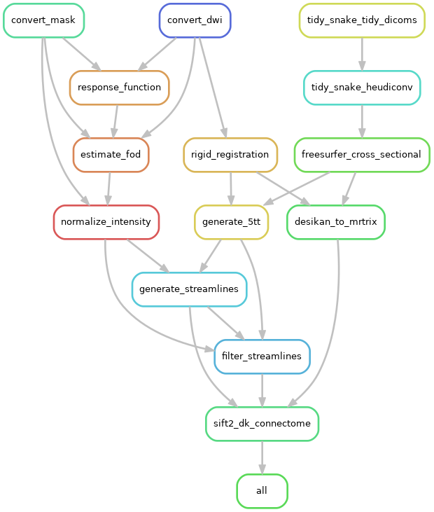

# Structural Connectivity Processing Workflow

This repository provides a Snakemake workflow to produce structural connectivity networks from diffusion MRI data and FreeSurfer parcellations. 


## Installation

*If you are using the [NeSI](https://www.nesi.org.nz) platform, please follow the [NeSI related documentation](NESI.md).*

To run this workflow on your workstation, you need to install the following softwares:

- `mamba`, a fast cross-platform package manager (see [installation instructions](https://mamba.readthedocs.io/en/latest/installation.htm))
- `apptainer`, a container system (see [installation instructions](https://apptainer.org/docs/admin/main/installation.html))
- `snakemake`, the workflow management system (see [installation instructions](https://snakemake.readthedocs.io/en/stable/getting_started/installation.html))
- `git`, the distributed version control system (see [download page](https://git-scm.com/downloads))

Clone this repository using:

```
git clone https://github.com/
```

Then edit the configuration file `config/config.yml`, setting the following entries:

- the ethics prefix `ethics_prefix` for your input files,
- the input data folder `datadir`,
- the results folder `resultsdir`,
- the path to your Freesurfer license `fs_license`,
- the path to the aquisition parameter file `aqcparams` and the index file `index` (see [--acqp](https://fsl.fmrib.ox.ac.uk/fsl/fslwiki/eddy/UsersGuide#A--acqp) and [--index](https://fsl.fmrib.ox.ac.uk/fsl/fslwiki/eddy/UsersGuide#A--index) sections in eddy user guide).
- the path to your `heudiconv` heuristic script (`heuristic` entry under `heudiconv` section).

You may want to edit other entries, in particular:

- for each software, compute resources (time, memory and threads) can be adjusted,
- for some software, additional command line arguments (e.g. see `cli_args` entry under `mriqc` section),
- entries in the `qc_status` section to skip `MRIQC` reports generation and set the default quality validation value.

Once this configuration is finished, you can run `snakemake` to start the workflow.

Use a dry-run to check that installation and configuration is working:

```
srun --account=uoa03264 --qos=debug profiles/nesi/snakemake.sl -n
snakemake -n
```


## Formats

The workflow assumes that input scan data are:

- folders or .zip files (you can mix both),
- stored in the `datadir` folder configured `config/config.yml`,
- they are named using the convention `<ethics_prefix>_<subject>_<session>`, where
  - `<ethics_prefix>` is set in [`config/config.yml`](config/config.yml),
  - `<session>` can be omitted, but will then be considered as `a`.

Within a input folder (or .zip file), only the parent folder of DICOM files will be kept when tidying the data.
Any other level of nesting will be ignored.

Once the workflow has completed, results are organised as follows:

```
<resultsdir>
└── bids
    ├── derivatives
    │   ├── eddy
    │   │   └── sub-<subject>
    │   │       └── ses-<session>
    │   │           └── dwi
    │   │               ├── sub-<subject>_ses-<session>_<entities>_eddy.eddy_cnr_maps.nii.gz
    │   │               ├── sub-<subject>_ses-<session>_<entities>_eddy.eddy_command_txt
    │   │               ├── sub-<subject>_ses-<session>_<entities>_eddy.eddy.json
    │   │               ├── sub-<subject>_ses-<session>_<entities>_eddy.eddy_movement_over_time
    │   │               ├── sub-<subject>_ses-<session>_<entities>_eddy.eddy_movement_rms
    │   │               ├── sub-<subject>_ses-<session>_<entities>_eddy.eddy_outlier_free_data.nii.gz
    │   │               ├── sub-<subject>_ses-<session>_<entities>_eddy.eddy_outlier_map
    │   │               ├── sub-<subject>_ses-<session>_<entities>_eddy.eddy_outlier_n_sqr_stdev_map
    │   │               ├── sub-<subject>_ses-<session>_<entities>_eddy.eddy_outlier_n_stdev_map
    │   │               ├── sub-<subject>_ses-<session>_<entities>_eddy.eddy_outlier_report
    │   │               ├── sub-<subject>_ses-<session>_<entities>_eddy.eddy_parameters
    │   │               ├── sub-<subject>_ses-<session>_<entities>_eddy.eddy_post_eddy_shell_alignment_parameters
    │   │               ├── sub-<subject>_ses-<session>_<entities>_eddy.eddy_post_eddy_shell_PE_translation_parameters
    │   │               ├── sub-<subject>_ses-<session>_<entities>_eddy.eddy_residuals.nii.gz
    │   │               ├── sub-<subject>_ses-<session>_<entities>_eddy.eddy_restricted_movement_rms
    │   │               ├── sub-<subject>_ses-<session>_<entities>_eddy.eddy_rotated_bvecs
    │   │               ├── sub-<subject>_ses-<session>_<entities>_eddy.eddy_shell_indicies.json
    │   │               ├── sub-<subject>_ses-<session>_<entities>_eddy.eddy_values_of_all_input_parameters
    │   │               └── sub-<subject>_ses-<session>_<entities>_eddy.nii.gz
    │   ├── eddy_quad
    │   │   └── sub-<subject>_ses-<session>_<entities>
    │   │       ├── avg_b0.png
    │   │       ├── avg_b1000.png
    │   │       ├── avg_b2000.png
    │   │       ├── avg_b3000.png
    │   │       ├── cnr0000.nii.gz.png
    │   │       ├── cnr0001.nii.gz.png
    │   │       ├── cnr0002.nii.gz.png
    │   │       ├── cnr0003.nii.gz.png
    │   │       ├── eddy_msr.txt
    │   │       ├── qc.json
    │   │       ├── qc.pdf
    │   │       ├── ref_list.png
    │   │       └── ref.txt
    │   ├── eddy_squad
    │   │   ├── group_db.json
    │   │   ├── group_qc.pdf
    │   │   ├── ref.txt
    │   │   └── ref_list.png
    │   ├── hd_bet
    │   │   └── sub-<subject>
    │   │       └── ses-<session>
    │   │           └── anat
    │   │               ├── sub-<subject>_ses-<session>_<entities>_T1w_brain_mask.nii.gz
    │   │               └── sub-<subject>_ses-<session>_<entities>_T1w_brain.nii.gz
    │   ├── mriqc
    │   │   ├── logs
    │   │   │   └── ...  # log files in case MRIQC crashes
    │   │   ├── sub-<subject>
    │   │   │   ├── figures
    │   │   │   │   ├── sub-<subject>_ses-<session>_<entities>_<suffix>.svg
    │   │   │   │   └── ...
    │   │   │   └── ses-<session>
    │   │   │       ├── <modality>
    │   │   │       │   └── sub-<subject>_ses-<session>_<entities>_<suffix>.json
    │   │   │       └── ...
    │   │   ├── dataset_description.json
    │   │   ├── quality_control.tsv
    │   │   ├── sub-<subject>_ses-<session>_qc.yaml
    │   │   ├── sub-<subject>_ses-<session>_<entities>_<suffix>.html
    │   │   └── ...
    │   ├── mrtrix3
    │   │   └── sub-<subject>
    │   │       └── ses-<session>
    │   │           └── dwi
    │   │               ├── sub-<subject>_ses-<session>_<entities>_bias.mif
    │   │               ├── sub-<subject>_ses-<session>_<entities>_dwi_brain_mask.nii.gz
    │   │               ├── sub-<subject>_ses-<session>_<entities>_dwi_brain.nii.gz
    │   │               ├── sub-<subject>_ses-<session>_<entities>_dwi_denoise.mif
    │   │               ├── sub-<subject>_ses-<session>_<entities>_dwidnbcdegibbs.mif
    │   │               ├── sub-<subject>_ses-<session>_<entities>_dwidnbcdg.nii.gz
    │   │               ├── sub-<subject>_ses-<session>_<entities>_dwidnbc.mif
    │   │               ├── sub-<subject>_ses-<session>_<entities>_dwi_mask.mif
    │   │               ├── sub-<subject>_ses-<session>_<entities>_dwi.mif
    │   │               ├── sub-<subject>_ses-<session>_<entities>_nodif.nii.gz
    │   │               └── sub-<subject>_ses-<session>_<entities>_noise.mif
    │   └── synb0_disco
    │       └── sub-<subject>_ses-<session>_<entities>
    │           ├── ANTS0GenericAffine.mat
    │           ├── ANTS1InverseWarp.nii.gz
    │           ├── ANTS1Warp.nii.gz
    │           ├── b0_all.nii.gz
    │           ├── b0_all.topup_log
    │           ├── b0_all_topup.nii.gz
    │           ├── b0_d_lin_atlas_2_5.nii.gz
    │           ├── b0_d_nonlin_atlas_2_5.nii.gz
    │           ├── b0_d_smooth.nii.gz
    │           ├── b0_u_lin_atlas_2_5_FOLD_1.nii.gz
    │           ├── b0_u_lin_atlas_2_5_FOLD_2.nii.gz
    │           ├── b0_u_lin_atlas_2_5_FOLD_3.nii.gz
    │           ├── b0_u_lin_atlas_2_5_FOLD_4.nii.gz
    │           ├── b0_u_lin_atlas_2_5_FOLD_5.nii.gz
    │           ├── b0_u_lin_atlas_2_5_merged.nii.gz
    │           ├── b0_u_lin_atlas_2_5.nii.gz
    │           ├── b0_u.nii.gz
    │           ├── epi_reg_d_ANTS.txt
    │           ├── epi_reg_d.mat
    │           ├── T1_mask.nii.gz
    │           ├── T1_norm_lin_atlas_2_5.nii.gz
    │           ├── T1_norm.nii.gz
    │           ├── T1_norm_nonlin_atlas_2_5.nii.gz
    │           ├── topup_fieldcoef.nii.gz
    │           └── topup_movpar.txt
    ├── sub-<subject>
    │   └── ses-<session>
    │       ├── <modality>
    │       │   ├── sub-<subject>_ses-<session>_<entities>_<suffix>.json
    │       │   ├── sub-<subject>_ses-<session>_<entities>_<suffix>.nii.gz
    │       │   └── ...
    │       ├── ...
    │       └── sub-<subject>_ses-<session>_scans.tsv
    ├── CHANGES
    ├── dataset_description.json
    ├── participants.json
    ├── participants.tsv
    ├── README
    └── scans.json
```

where

- `<resultsdir>` is the results directory configured in `config/config.yaml`
- `<subject>` is a subject,
- `<session>` is a subject's session,
- `<modality>` is a modality (e.g. `anat` or `dwi`),
- `<entities>` are BIDs entities (`task`, `run`, etc.),
- `<suffix>` is a BIDs suffix, either `T1w`, `T2w`, `dwi` or `bold`.

TODO explain the QC files (copy from tidySnake?)

TODO detail the key output files

TODO add a note that eddy squad is only run if more than one recording


## Workflow

The complete workflow consists of multiple steps depicted in the following graph.



You will need to delete or comment out all print statements from your workflow before running

*Workflow graph generated with `srun --account=uoa03264 --qos=debug profiles/nesi/snakemake.sl --rulegraph | dot -Tpng > rulegraph.png`

The role of each step is the following:

- TODO explain each step (copy some from tidySnake?)

When possible, each step is run independently for each run, task and session of a subject.


## Useful Snakemake options

View steps within workflow using rulegraph:

```
srun --account=uoa03264 --qos=debug profiles/nesi/snakemake.sl --forceall --rulegraph | dot -Tpdf > rulegraph.pdf
snakemake --forceall --rulegraph | dot -Tpdf > rulegraph.pdf
```

Use the [*local* profile](profiles/local/config.yaml), presetting many options to run the workflow locally:

```
snakemake --profile profiles/local
```

Inform `snakemake` of the maximum amount of memory available on the workstation:

```
snakemake --resources mem=48GB
```

Keep incomplete files (useful for debugging) from fail jobs, instead of wiping them:

```
snakemake --keep-incomplete
```

Run the pipeline until a certain file or rule, e.g. the `bias_correction` rule:

```
snakemake --until bias_correction
```

All these options can be combined and used with a profile, for example:

```
snakemake --profile profiles/local --keep-incomplete --until bias_correction
```

Unlock the folder, in case `snakemake` had to be interrupted abruptly previously:

```
snakemake --unlock
```

*Note: This last hint will be mentioned to you by `snakemake` itself.
Use it only when recommended to to so ;-).*


## Maintenance

TODO replace with currently available environments

The conda environment file [workflow/envs/mri.yaml](workflow/envs/mri.yaml) with pinned versions is generated from a version without versions [workflow/envs/mri_base.yaml](workflow/envs/mri_base.yaml).

You can update it using:

```
conda env create -f workflow/envs/mri_base.yaml -p ./mri_env
conda env export -p ./mri_env --no-builds | grep -v '^prefix:' > workflow/envs/mri.yaml
conda env remove -p ./mri_env
```
